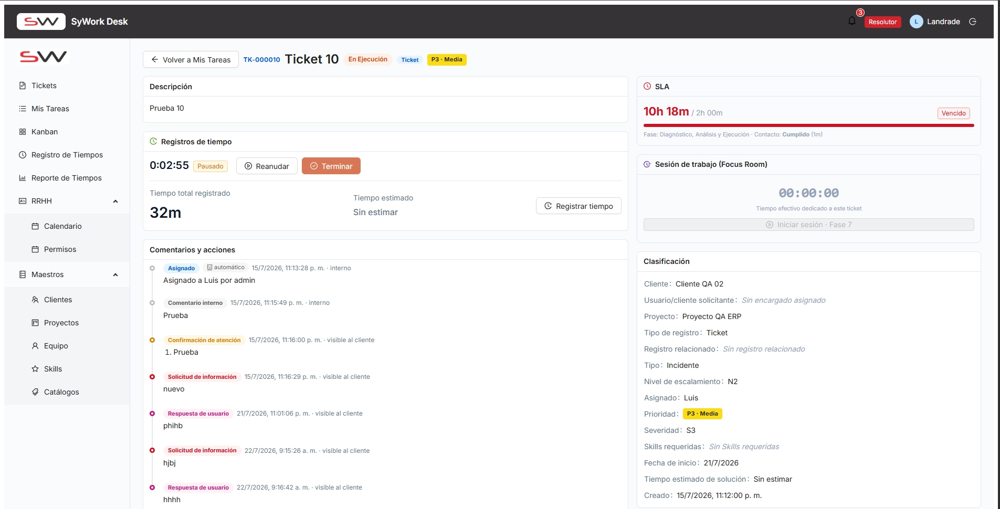
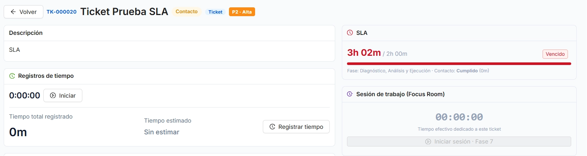
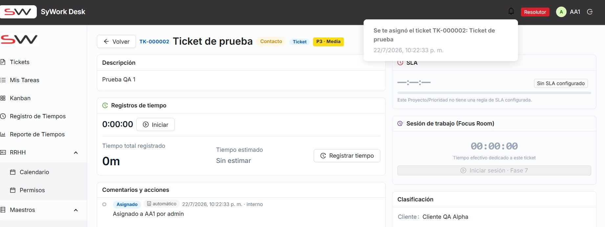

# ITER-005 — Iteración de pruebas

## Objetivo de la iteración

Incorporación al framework UAT de la documentación de errores recopilada por Arely Pazmiño en `docs/Documentacion_Errores_Arely/DocumentoErrores4.md` (hallazgos EA-021–EA-0023, 3 hallazgos). El archivo `.md` referenciaba evidencia gráfica sin adjuntarla; las capturas correspondientes se extrajeron del PDF complementario `DocumentoErrores4.pdf` y se renombraron a la convención `OBS-XXXX-NN.png` en `images/`.

El documento fuente ya declaraba internamente `Iteración de origen: ITER-004` para los tres hallazgos, igual que en `DocumentacionErrores2.docx`/`DocumentoErrores3.md`. Sin embargo, `ITER-004` ya fue cerrada e incorporada al framework como iteración inmutable (ver `CONVENTIONS.md` — "Reglas de inmutabilidad"), por lo que estos hallazgos, recibidos en una entrega posterior, se registran como una nueva iteración, `ITER-005`.

Cubren el cálculo del SLA en Tickets al cambiar de estado y al crearse fuera del horario laboral configurado, y el comportamiento de creación/asignación de tickets fuera de jornada.

> Nota: el documento original no especifica versión de la app probada ni entorno.

**Nota de mapeo de tipos**: al igual que en `ITER-004`, el documento fuente usa la taxonomía de tres tipos (`Bug`, `Mejora`, `Observación`) mientras que el framework UAT define solo dos (`Defecto`, `Mejora`, ver `CONVENTIONS.md`). Se mapeó `Bug` → `Defecto` y `Observación` → `Mejora`.

**Nota de numeración**: el documento fuente identifica el tercer hallazgo como `EA-0023` (4 dígitos), inconsistente con la numeración de 3 dígitos de `EA-021`/`EA-022` que lo preceden. Se preserva la referencia original tal cual en el detalle de la observación; no afecta la numeración `OBS-XXXX` asignada por este framework.

## Resumen de observaciones

| ID | Módulo/Pantalla | Tipo | Estado | Reportado por |
|---|---|---|---|---|
| OBS-0038 | Tickets > Detalle del Ticket > SLA | Defecto | Abierta | Arely Pazmiño |
| OBS-0039 | Tickets > Detalle del Ticket > SLA | Defecto | Abierta | Arely Pazmiño |
| OBS-0040 | Tickets > Panel de Asignación / Detalle del Ticket | Mejora | Abierta | Arely Pazmiño |

## Detalle de observaciones

### OBS-0038 — El SLA contabiliza tiempo fuera del horario laboral al cambiar el estado del ticket

- **Módulo/Pantalla:** Tickets > Detalle del Ticket > SLA
- **Tipo:** Defecto
- **Estado:** Abierta
- **Reportado por:** Arely Pazmiño
- **Iteración de origen:** ITER-005
- **Iteración de cierre:** —

**Descripción**
Se realizó una prueba con un recurso que tiene configurado un horario laboral de 08:00 a 17:00. Durante la prueba, se registró tiempo sobre un ticket aproximadamente a las 23:00, fuera del horario laboral, mientras el SLA se encontraba pausado.

Posteriormente, al regresar al horario laboral, el SLA mostraba aproximadamente 1 hora y 20 minutos restantes, lo que indica que el sistema conservaba correctamente tiempo disponible para el cumplimiento del SLA.

Sin embargo, al cambiar el estado del ticket a Solicitud de información, el SLA pasó a mostrar un tiempo de 10 horas y posteriormente apareció como vencido.

*(Referencia original: `EA-021`.)*

**Pasos para reproducir**
1. Configurar un recurso con horario laboral de 08:00 a 17:00.
2. Registrar tiempo sobre un ticket asignado a ese recurso fuera del horario laboral (aprox. 23:00), con el SLA pausado.
3. Esperar al siguiente período laboral y observar que el SLA muestra correctamente el tiempo restante (~1h 20m).
4. Cambiar el estado del ticket a "Solicitud de información".
5. Observar que el SLA pasa a mostrar 10 horas consumidas y posteriormente aparece como Vencido.

**Resultado esperado / Situación actual**
Situación actual: el SLA muestra un tiempo consumido superior al tiempo laboral real transcurrido. En la prueba, el ticket comenzó a contabilizarse dentro del horario laboral y había transcurrido aproximadamente una hora; sin embargo, el sistema muestra aproximadamente tres horas de tiempo consumido y marca el SLA como vencido.

**Resultado actual / Propuesta de mejora**
Revisar el cálculo del SLA para garantizar que únicamente se contabilice el tiempo correspondiente al horario laboral configurado.

El sistema no debería sumar:
- Tiempo fuera del horario laboral.
- Tiempo durante el cual el SLA se encuentra pausado.
- Tiempo correspondiente a períodos no laborales.

**Criterios de aceptación**
- [ ] El tiempo del SLA se contabiliza únicamente dentro del horario laboral configurado.
- [ ] El tiempo registrado fuera del horario laboral no afecta el contador del SLA.
- [ ] Cuando el SLA está pausado, el contador no debe consumir tiempo.
- [ ] El sistema debe calcular correctamente el tiempo transcurrido y el tiempo restante.
- [ ] El ticket no debe aparecer como vencido antes de que realmente se consuma el tiempo laboral configurado.

**Evidencia**

### OBS-0039 — El SLA contabiliza tiempo incorrectamente cuando el ticket es creado fuera del horario laboral

- **Módulo/Pantalla:** Tickets > Detalle del Ticket > SLA
- **Tipo:** Defecto
- **Estado:** Abierta
- **Reportado por:** Arely Pazmiño
- **Iteración de origen:** ITER-005
- **Iteración de cierre:** —

**Descripción**
Se creó un ticket fuera del horario laboral configurado. El calendario tiene un horario de trabajo de 08:00 a 17:00.

El ticket fue creado fuera de este horario y posteriormente asignado a un resolutor. El SLA comenzó a contabilizarse cuando inició el horario laboral.

Durante la prueba, había transcurrido aproximadamente una hora dentro del horario laboral. Sin embargo, el sistema mostraba que habían transcurrido aproximadamente tres horas y el SLA aparecía como Vencido.

*(Referencia original: `EA-022`.)*

**Pasos para reproducir**
1. Configurar un calendario con horario laboral de 08:00 a 17:00.
2. Crear un ticket fuera de ese horario laboral.
3. Asignar el ticket a un resolutor; el SLA comienza a contabilizarse al iniciar el horario laboral.
4. Esperar aproximadamente una hora dentro del horario laboral.
5. Observar que el SLA muestra aproximadamente tres horas transcurridas y aparece como Vencido.

**Resultado esperado / Situación actual**
Situación actual: el sistema parece contabilizar tiempo adicional al tiempo laboral real transcurrido desde el inicio del SLA.

**Resultado actual / Propuesta de mejora**
Revisar el cálculo del tiempo transcurrido cuando un ticket se crea fuera de la jornada laboral.

Si el ticket se crea fuera del horario laboral, el sistema debería:
1. Registrar la fecha y hora de creación.
2. Esperar hasta el siguiente período laboral.
3. Iniciar el SLA únicamente dentro del horario configurado.
4. Contabilizar exclusivamente el tiempo laboral transcurrido.

**Criterios de aceptación**
- [ ] Un ticket creado fuera del horario laboral no consume tiempo de SLA mientras el calendario se encuentre fuera de jornada.
- [ ] El contador comienza únicamente al iniciar el siguiente período laboral.
- [ ] El sistema calcula correctamente el tiempo laboral transcurrido.
- [ ] El tiempo mostrado en el SLA coincide con el tiempo real consumido dentro del calendario laboral.
- [ ] El SLA no se marca como vencido antes de alcanzar el tiempo límite configurado.

**Evidencia**

### OBS-0040 — Se permite asignar un ticket fuera del horario laboral

- **Módulo/Pantalla:** Tickets > Panel de Asignación / Detalle del Ticket
- **Tipo:** Mejora
- **Estado:** Abierta
- **Reportado por:** Arely Pazmiño
- **Iteración de origen:** ITER-005
- **Iteración de cierre:** —

**Descripción**
Se verificó que es posible crear un ticket y asignarlo a un resolutor aunque la operación se realice fuera del horario laboral configurado.

*(Referencia original: `EA-0023`.)*

**Resultado esperado / Situación actual**
Situación actual: el sistema permite crear y asignar tickets fuera de la jornada laboral.

**Resultado actual / Propuesta de mejora**
Validar si este comportamiento corresponde a la regla de negocio esperada.

Se recomienda permitir la creación y asignación fuera del horario laboral, ya que un ticket puede llegar en cualquier momento. Sin embargo, el sistema debería diferenciar claramente entre:
- Hora de creación del ticket.
- Hora de asignación.
- Inicio efectivo del SLA.
- Inicio de la jornada laboral.

**Criterios de aceptación**
- [ ] El sistema permite crear tickets fuera del horario laboral.
- [ ] El sistema permite asignarlos si el usuario tiene permisos.
- [ ] El SLA respeta el calendario configurado.
- [ ] El tiempo fuera de la jornada no se contabiliza incorrectamente.
- [ ] La hora real de creación y asignación se conserva en el historial.

**Evidencia**

