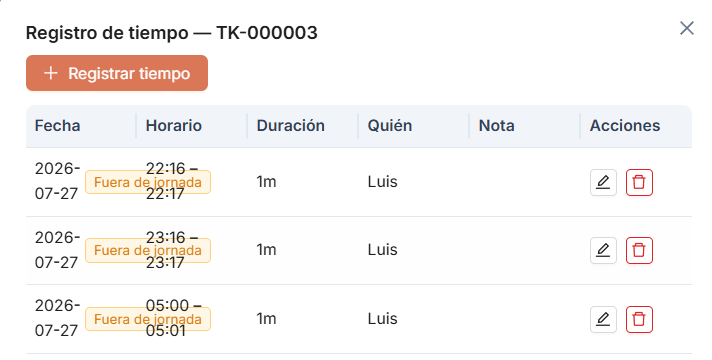
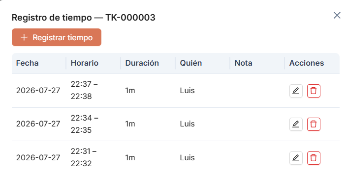
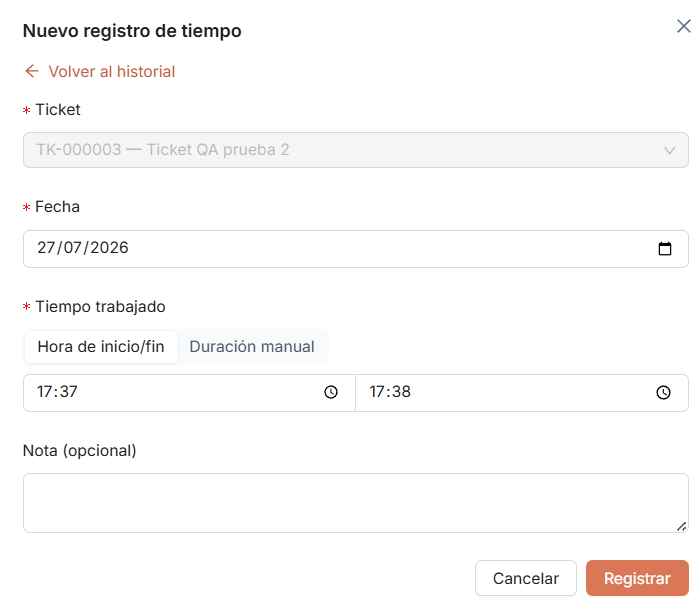
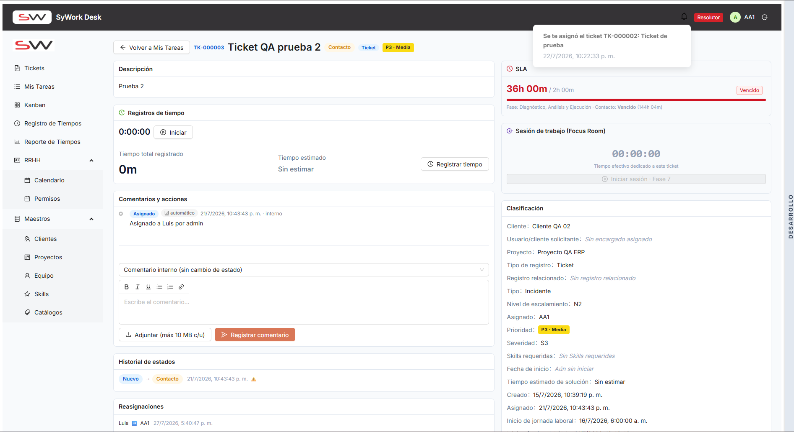

# ITER-008 — Iteración de pruebas

## Objetivo de la iteración

Incorporación al framework UAT de la documentación de errores recopilada por Arely Pazmiño en `docs/Documentacion_Errores_Arely/Documento Errores 5.docx` (hallazgos EA-024–EA-027, 4 hallazgos). El documento ya seguía la estructura de campos definida en `CONVENTIONS.md` (Módulo/Pantalla, Tipo, Estado, Reportado por, Descripción, Resultado esperado/Situación actual, Resultado actual/Propuesta de mejora, Criterios de aceptación, Evidencia); se conserva el contenido tal como fue redactado, adaptando el formato a Markdown y asignando los `OBS-XXXX` correspondientes. Las capturas de evidencia embebidas en el `.docx` se extrajeron y se renombraron a la convención `OBS-XXXX-NN.png` en `images/`.

El documento fuente declara internamente `Iteración de origen: ITER-004` para los cuatro hallazgos, igual que en entregas previas de Arely Pazmiño (`DocumentoErrores4.md`/`DocumentoErrores4.pdf`, incorporados como `ITER-005`). Sin embargo, tanto `ITER-004` como `ITER-005` ya están cerradas e incorporadas al framework como iteraciones inmutables (ver `CONVENTIONS.md` — "Reglas de inmutabilidad"), por lo que estos hallazgos, recibidos en una entrega posterior, se registran como una nueva iteración, `ITER-008`.

Cubren la hora mostrada en el historial de registros de tiempo, la legibilidad de la etiqueta "Fuera de jornada" sobre el horario registrado, la ausencia de notificación al (re)asignar un ticket, y la posibilidad de asignar tickets a usuarios inactivos.

> Nota: el documento original no especifica versión de la app probada ni entorno.

**Nota de mapeo de tipos**: al igual que en `ITER-004`/`ITER-005`, el documento fuente usa `Bug`/`Mejora` mientras que el framework UAT define `Defecto`/`Mejora` (ver `CONVENTIONS.md`). Se mapeó `Bug` → `Defecto`.

**Nota de numeración**: el documento fuente identifica los hallazgos como `EA-024`, `EA-0025`, `EA-0026` y `EA-027`, alternando entre 3 y 4 dígitos sin un patrón consistente (la misma inconsistencia ya observada en `ITER-005` con `EA-0023`). Se preserva la referencia original tal cual en el detalle de cada observación; no afecta la numeración `OBS-XXXX` asignada por este framework.

**Nota de evidencia**: el documento fuente adjunta 4 imágenes sin asociación explícita 1 a 1 con cada hallazgo. Se asignaron por contenido: las dos capturas del formulario "Nuevo registro de tiempo" (hora ingresada `17:37–17:38`) y del historial resultante (`22:37–22:38`, un desfase de ~5 horas) se asociaron a `OBS-0044` (par entrada/resultado); la captura del historial con la etiqueta "Fuera de jornada" superpuesta a los horarios `22:16–22:17` / `23:16–23:17` / `05:00–05:01` se asoció a `OBS-0045`; la captura del detalle de ticket con la notificación de asignación visible se asoció a `OBS-0046`. `EA-027` no tenía evidencia gráfica adjunta en el documento fuente.

**Nota de pasos para reproducir**: el documento fuente no incluye una sección explícita "Pasos para reproducir" (a diferencia de `ITER-004`/`005`). Para los hallazgos de tipo `Defecto` (`OBS-0044`, `OBS-0047`), donde `CONVENTIONS.md` la exige, se derivaron a partir de la narrativa ya descrita en "Descripción"/"Resultado actual", sin agregar información no presente en el documento original.

## Resumen de observaciones

| ID | Módulo/Pantalla | Tipo | Estado | Reportado por |
|---|---|---|---|---|
| OBS-0044 | Registro de tiempos > Historial de registros | Defecto | Abierta | Arely Pazmiño |
| OBS-0045 | Registro de tiempos > Historial de registros | Mejora | Abierta | Arely Pazmiño |
| OBS-0046 | Panel de Asignación / Notificaciones | Mejora | Abierta | Arely Pazmiño |
| OBS-0047 | Panel de Asignación | Defecto | Abierta | Arely Pazmiño |

## Detalle de observaciones

### OBS-0044 — El historial de registros de tiempo muestra una hora diferente a la hora real del registro

- **Módulo/Pantalla:** Registro de tiempos > Historial de registros
- **Tipo:** Defecto
- **Estado:** Abierta
- **Reportado por:** Arely Pazmiño
- **Iteración de origen:** ITER-008
- **Iteración de cierre:** —

**Descripción**
Al registrar tiempo manualmente, el sistema muestra una hora distinta a la que realmente fue ingresada.

Durante la prueba, el registro se realizó aproximadamente entre las 17:16 y 17:17; sin embargo, el historial muestra el horario 22:16–22:17, generando una diferencia aproximada de cinco horas.

*(Referencia original: `EA-024`.)*

**Pasos para reproducir**
1. Abrir un ticket y registrar tiempo manualmente indicando una hora de inicio/fin real (ej. 17:37–17:38).
2. Abrir el historial de registros de tiempo del mismo ticket.
3. Observar que el horario mostrado en el historial no coincide con el ingresado (ej. aparece 22:37–22:38), con una diferencia aproximada de cinco horas.

**Resultado esperado / Situación actual**
Situación actual: La hora presentada en el historial no coincide con la hora real en la que se realizó el registro.

**Resultado actual / Propuesta de mejora**
Revisar el manejo de la zona horaria utilizada para almacenar y mostrar los registros de tiempo.

La interfaz debe presentar siempre la hora correspondiente a la configuración horaria del usuario o de la organización.

**Criterios de aceptación**
- [ ] La hora mostrada coincide con la hora real del registro.
- [ ] No existen diferencias ocasionadas por conversiones de zona horaria.
- [ ] La misma hora se visualiza de forma consistente en todas las pantallas relacionadas con el registro de tiempos.

**Evidencia**

### OBS-0045 — La etiqueta "Fuera de jornada" dificulta la visualización del horario registrado

- **Módulo/Pantalla:** Registro de tiempos > Historial de registros
- **Tipo:** Mejora
- **Estado:** Abierta
- **Reportado por:** Arely Pazmiño
- **Iteración de origen:** ITER-008
- **Iteración de cierre:** —

**Descripción**
Cuando un registro de tiempo se realiza fuera del horario laboral, el sistema muestra la etiqueta "Fuera de jornada" sobre la información del horario registrado, lo que dificulta visualizar correctamente la hora de inicio y fin.

*(Referencia original: `EA-0025`.)*

**Resultado esperado / Situación actual**
Situación actual: La etiqueta se muestra sobre el horario del registro, ocultando parcialmente la información y reduciendo la legibilidad.

**Resultado actual / Propuesta de mejora**
Reubicar la etiqueta "Fuera de jornada" para que no interfiera con la visualización del horario. Algunas alternativas son:
- Mostrar la etiqueta en una columna independiente.
- Ubicarla debajo del horario, sin superponerse al texto.
- Mostrarla como un distintivo (badge) al final de la fila.
- Utilizar un ícono con un tooltip que indique "Fuera de jornada".

**Criterios de aceptación**
- [ ] La hora de inicio y fin del registro es completamente visible.
- [ ] La etiqueta "Fuera de jornada" no oculta información del horario.
- [ ] La información del registro mantiene una distribución clara y fácil de leer.
- [ ] La solución es consistente con el diseño del resto de la aplicación.

**Evidencia**

### OBS-0046 — No se genera una notificación al cambiar el resolutor de un ticket

- **Módulo/Pantalla:** Panel de Asignación / Notificaciones
- **Tipo:** Mejora
- **Estado:** Abierta
- **Reportado por:** Arely Pazmiño
- **Iteración de origen:** ITER-008
- **Iteración de cierre:** —

**Descripción**
Al reasignar un ticket de un resolutor a otro, el sistema realiza correctamente el cambio de responsable; sin embargo, no genera una notificación para informar al nuevo resolutor que tiene un ticket asignado.

*(Referencia original: `EA-0026`.)*

**Resultado esperado / Situación actual**
Situación actual: El ticket cambia de responsable, pero el nuevo resolutor no recibe una notificación dentro de la aplicación.

**Resultado actual / Propuesta de mejora**
Generar automáticamente una notificación cada vez que un ticket sea asignado o reasignado a un resolutor.

La notificación debería incluir información básica como:
- Número del ticket.
- Cliente.
- Prioridad.
- Estado actual.
- Usuario que realizó la asignación.
- Fecha y hora de la asignación.

Además, la notificación debería dirigir al usuario directamente al detalle del ticket.

**Criterios de aceptación**
- [ ] Al asignar un ticket por primera vez, el resolutor recibe una notificación.
- [ ] Al cambiar el resolutor, el nuevo responsable recibe una notificación.
- [ ] La notificación aparece en el centro de notificaciones de la aplicación.
- [ ] Al seleccionar la notificación, el usuario es dirigido al detalle del ticket correspondiente.

**Evidencia**

### OBS-0047 — El sistema permite asignar tickets a usuarios inactivos

- **Módulo/Pantalla:** Panel de Asignación
- **Tipo:** Defecto
- **Estado:** Abierta
- **Reportado por:** Arely Pazmiño
- **Iteración de origen:** ITER-008
- **Iteración de cierre:** —

**Descripción**
Se verificó que el sistema permite asignar un ticket a un usuario cuyo estado se encuentra como Inactivo.

*(Referencia original: `EA-027`.)*

**Pasos para reproducir**
1. Marcar a un usuario con rol Resolutor como Inactivo (Maestros > Equipo).
2. Ir al Panel de Asignación (o al detalle de un ticket) y abrir el selector de resolutor.
3. Verificar que el usuario inactivo aparece disponible/seleccionable en la lista.
4. Asignar el ticket a ese usuario y confirmar que el sistema permite guardar la asignación.

**Resultado esperado / Situación actual**
Situación actual: El usuario aparece disponible para ser seleccionado como responsable del ticket, aunque su cuenta esté inactiva.

**Resultado actual / Propuesta de mejora**
El sistema debe impedir la asignación de tickets a usuarios inactivos.

Los usuarios con estado Inactivo no deberían aparecer en la lista de resolutores disponibles o, en caso de visualizarse, deberían mostrarse deshabilitados y no ser seleccionables.

**Criterios de aceptación**
- [ ] Los usuarios inactivos no pueden recibir nuevas asignaciones.
- [ ] El sistema impide guardar una asignación si el usuario está inactivo.
- [ ] Se muestra un mensaje indicando que el usuario seleccionado no se encuentra disponible.
- [ ] Solo los usuarios activos pueden aparecer como opciones válidas para la asignación de tickets.

**Evidencia**
No se adjuntó evidencia gráfica en el documento original.
